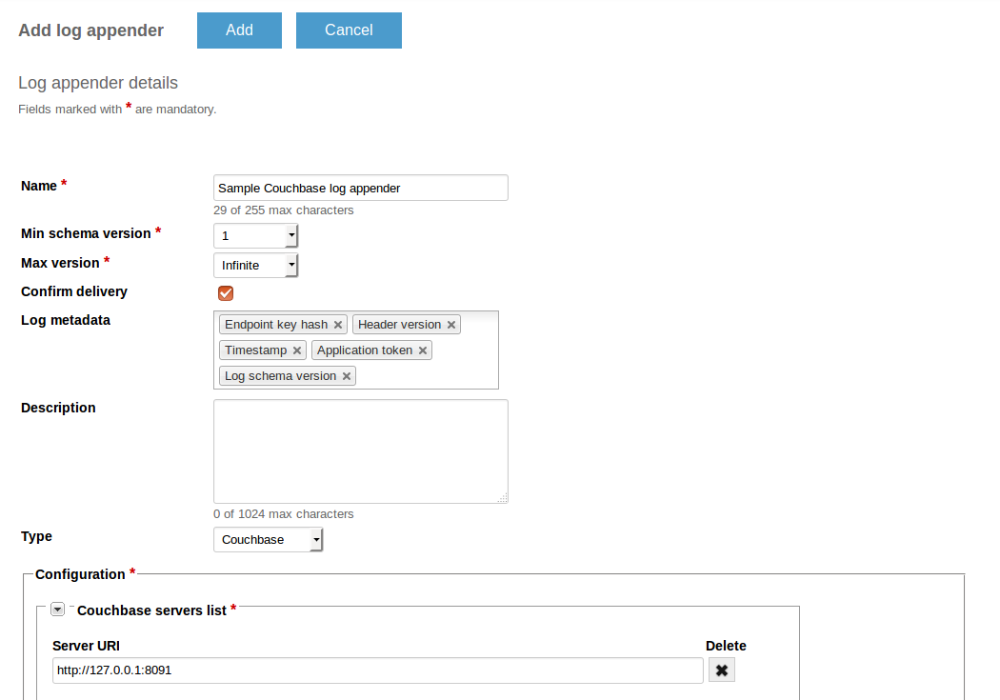



* TOC
{:toc}

The Couchbase log appender is responsible for transferring logs from the Operations service to the [Couchbase](http://www.couchbase.com/) database.

Each log document consists of the following fields:  

* _id_ - randomly generated UUID string
* _header_ - includes log's metainformation: _endpointKeyHash_ (a key hash identifying the endpoint which produced the log record),
_[applicationToken]({{root_url}}Glossary)_ (matches the token of the current application), _headerVersion_ (currently is 1),
_timestamp_ (a timestamp in milliseconds when logs were uploaded to the key/value storage)
* _event_ - log body (log item, received from a client)

Values are stored as serialized Generic Records using record wrapper avro schema.

# Creating Couchbase log appender in Admin UI

The easiest way to create a Couchbase log appender for your application is by using Admin UI.

To create a log appender of the Couchbase storage type, do the following:

1. In the **Log appenders** window, click **Add log appender**. And configure it as described below:

2. Enter the log appender name and description, select the minimum and maximum supported schema version, select necessary log metadata fields.
3. Set the log appender type to _Couchbase_.
4. Fill in the Couchbase server list and other fields.
5. Click **Add** button. Log appender is ready and operational at this point.

# Creating Couchbase log appender with Admin REST API

It is also possible to create a Couchbase log appender for your application by using [Admin REST API]({{root_url}}Programming-guide/Server-REST-APIs/#!/Logging/editLogAppender).
The following example illustrates how to create the Couchbase log appender via Admin REST API.

## Configuration

The Couchbase log appender configuration must match to
[this](https://github.com/kaaproject/kaa/blob/master/server/appenders/couchbase-appender/src/main/avro/couchbase-appender-config.avsc) Avro schema.

An example configuration that matches to previously introduced Avro schema is as below:

```json
{
    "couchbaseServerUris":[
        {
            "serverUri":"http://127.0.0.1:8091"
        }
    ],
    "bucket":"kaa",
    "password":null
}
```

## Administration

The following Admin REST API call example illustrates how to create a new Couchbase log appender.

```bash
curl -v -S -u devuser:devuser123 -X POST -H 'Content-Type: application/json' -d @couchbaseLogAppender.json "http://localhost:8080/kaaAdmin/rest/api/logAppender" | python -mjson.tool
```
where file ```couchbaseLogAppender.json``` contains following data:

```json
{
    "pluginClassName":"org.kaaproject.kaa.server.appenders.couchbase.appender.CouchbaseLogAppender",
    "pluginTypeName":"Couchbase",
    "applicationId":"5",
    "applicationToken":"82635305199158071549",
    "name":"Sample Couchbase log appender",
    "description":"Playing with Couchbase log appender",
    "headerStructure":[
        "KEYHASH",
        "VERSION",
        "TIMESTAMP",
        "TOKEN",
        "LSVERSION"
    ],
    "maxLogSchemaVersion":2147483647,
    "minLogSchemaVersion":1,
    "tenantId":"1",
    "jsonConfiguration":"{\"couchbaseServerUris\":[{\"serverUri\":\"http://127.0.0.1:8091\"}],\"bucket\":\"kaa\",\"password\":{\"string\":\"\"}}"
}
```

Example result:

```json
{
    "applicationId": "5",
    "applicationToken": "82635305199158071549",
    "confirmDelivery": true,
    "createdTime": 1466071152031,
    "createdUsername": "devuser",
    "description": "Playing with Couchbase log appender",
    "headerStructure": [
        "KEYHASH",
        "VERSION",
        "TIMESTAMP",
        "TOKEN",
        "LSVERSION"
    ],
    "id": "65551",
    "jsonConfiguration": "{\"couchbaseServerUris\":[{\"serverUri\":\"http://127.0.0.1:8091\"}],\"bucket\":\"kaa\",\"password\":{\"string\":\"\"}}",
    "maxLogSchemaVersion": 2147483647,
    "minLogSchemaVersion": 1,
    "name": "Sample Couchbase log appender",
    "pluginClassName": "org.kaaproject.kaa.server.appenders.couchbase.appender.CouchbaseLogAppender",
    "pluginTypeName": "Couchbase",
    "tenantId": "1"
}
```

# Playing with Couchbase log appender

1. Download and install Couchbase by following [link](http://developer.couchbase.com/documentation/server/current/getting-started/installing.html#installing).
2. After successful installation open http://%your_host_name%:8091/. <br/>
You should see something like that:

3. Click **Setup**.

4. Click **Next**.

5. Click **Next**.

6. Click **Next**.

7. Read and agree to the terms and conditions associated with this product. Click **Next**.

8. Create an administrator account for this Server. Click **Next**.
You should see something like that:

9. Go to Admin UI and add a Couchbase log appender to Data Collection demo application.

10. Define a URL and bucket which will be used for receiving logs.

11. Go to Data collection demos in Sandbox.

Use instruction from sandbox to run demo application.
12. Open http://%your_host_name%:8091 and choose : Data Buckets -> kaa -> Documents:

13. If you launched Data collection demo application before it, you should observe similar output:


If your output doesn't match above one, please follow our [troubleshooting guide]({{root_url}}Administration-guide/Troubleshooting).
